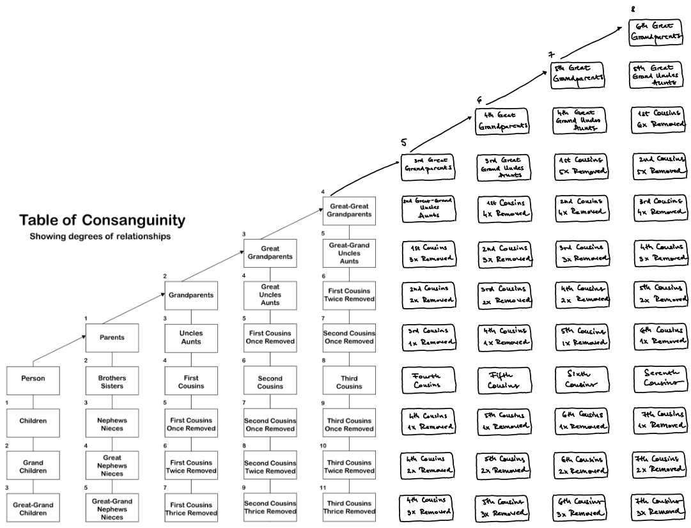

<table style="border: none">
<tr>
<td>

## Banyan

([Encyclopædia Britannica](https://www.britannica.com/plant/banyan)) *A **banyan** (Ficus benghalensis), also called Indian banyan or banyan fig, is an unusually shaped tree of the mulberry family (Moraceae) native to the Indian subcontinent. The banyan reaches a height up to 30 metres (100 feet) and spreads laterally indefinitely.*

The name was chosen to honour multi-generational families, whose branches spread like a banyan canopy.

</td>
</tr>
</table>

## Quick intro

This small library, inspired by [williamcasey's](https://github.com/williamcasey) [lineage](https://github.com/williamcasey/lineage), helps you find the **consanguine** relationship between two family members in a complex family tree. 

Consanguinity is defined as having a kinship with another person by being descended from a common ancestor; the algorithm makes great use of the information in this [Wikipedia article](https://en.wikipedia.org/wiki/Consanguinity) and directly references the following consanguinity table: 

Fig. 1 - Table of Consanguinity from <a href='https://en.wikipedia.org/wiki/Consanguinity#/media/File:Table_of_Consanguinity_showing_degrees_of_relationship.svg'>Wikipedia</a> + personal notes

In order to use this, you need to:
* create a [family tree](https://github.com/ioanastumb/banyan/blob/main/data/family-provider.js) and define the [settings](https://github.com/ioanastumb/banyan/blob/main/data/settings-provider.js) in their appropriate files
  * restrictions: the family node IDs must be unique; the highest ancestor from a family branch must have the parents set as `[-1]`
  * take care in setting up the proper parent-child relationships
  * take care in setting up the proper family branches - children should have both parents' family branches in order to be properly related to them
  * samples from the wonderful Harry Potter universe can be found in this repository (linked above)
* call the `[Family.getKinshipByNames()](https://github.com/ioanastumb/banyan/blob/main/src/family.js#L140)` method with the desired family member names
  * samples can be found in the [main.js](https://github.com/ioanastumb/banyan/blob/main/main.js) & [family.test.js](https://github.com/ioanastumb/banyan/blob/main/tests/family.test.js) files

A more in-depth guide will be provided soon!

## Caveats 

As this library concerns itself only with the consanguine familial relationships, it will not be able to identify any relationships gained via marriages along the way. This feature might come in the future. 

Also, since the algorithm takes into consideration the various family branches setup for each family member, you will encounter situations where it returns duplicate values - this is most obvious in a parent/child relationship at the bottom of the family tree. 

As a final note, the algorithm can take into consideration uncommon situations like incest, however multiple (dummy) family branches must be used to represent such situations. 

## Acknowledgements

As mentioned, this library makes heave use of the [lineage](https://github.com/williamcasey/lineage) algorithm - thank you, [williamcasey](https://github.com/williamcasey), for building it in the first place.